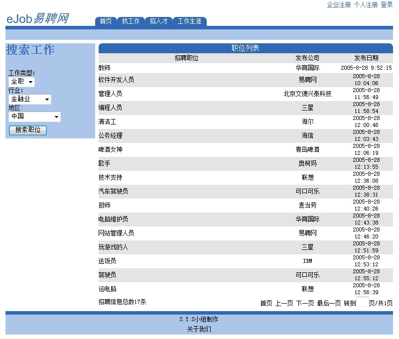

# 招聘网站

## 简介
写于2005年。

## 网站界面

## 运行环境
* 语言: asp
* 系统: windows server
* web服务器: iis
* 数据库: SQL Server 2000

## 数据库
数据库文件放在job_data文件夹内，连接方式采用odbc，odbc名:ejob。

## 功能
网站用户分为企业用户、个人用户和管理员。

企业用户和个人用户可以在网站前台注册。企业用户注册成功登录后可发布招聘信息。个人用户注册成功登录后可以发出面试申请。个人用户完善完简历后可以把简历加入到人才库中。

## 特色

邀请面试的功能，企业看到合适的人才后可以发出面试邀请，个人登录系统后可以看到邀请，并且选择接受或拒绝。

这个功能不算什么，不过05年的时候第一次写动态网站想到这个功能我觉得还是挺厉害的吧。
